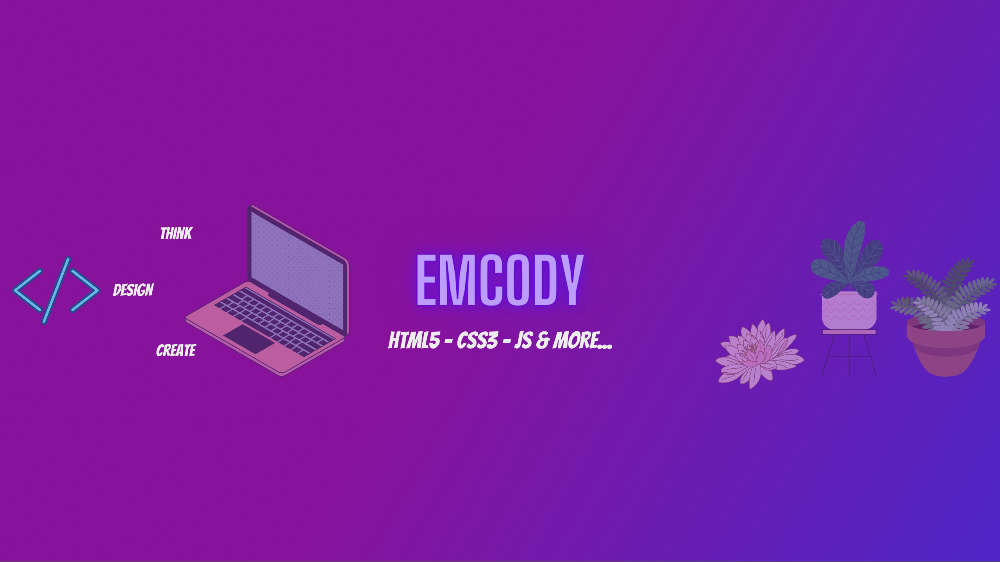
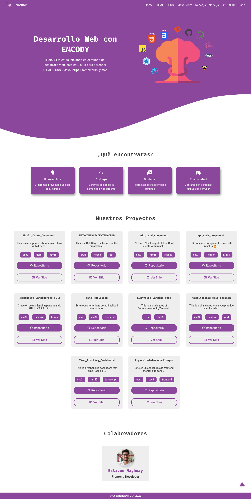

  

## **Estiven Mayhuay 🙋🤠**

Hello everyone! I'm Estiven, I love solving problems with Web Technologies, I'm studying to be a **Frontend Developer**. I love learning new technologies, teaching other people and sharing what I know. 💁 I hope my projects interest you. 😀

## **Community**

We have a community call **EMCODY**. It help you to learn new web technologies. If you are interesting please check the following links:

<ul>
  <li>
    <a target="_blank" style="underline: none; color: #eee;" href="https://discord.gg/tqVG9RcB">Discord </a>
  </li>
  <li>
    <a target="_blank" style="underline: none; color: #eee;" href="https://www.youtube.com/channel/UCKmXlegNzxRIhWz1vP1YuZw">YouTube </a>
  </li>
    <li>
    <a target="_blank" style="underline: none; color: #eee;" href="https://estivenmayhuay.github.io/emcody/index.html">Blog </a>
  </li>
</ul>

## **Technologies**

<table border="0" style="border-collapse: none">
  <thead>
    <tr style="background: #8040ea">
      <th style="color: #fff;">Frontend</th>
      <th style="color: #fff;">Backend</th>
      <th style="color: #fff;">Other Tools</th>
    </th>
  </thead>
  <tbody>
    <tr>
      <td>
        
      </td>
      <td>
        
      </td>
      <td>
        
      </td>
    </td>
    <tr>
      <td>
        
      </td>
      <td>
        
      </td>
      <td>
        
      </td>
    </tr>
    <tr>
      <td>
        
      </td>
      <td>
        
      </td> 
    </tr>
    <tr>
      <td>
        
      </td>
    </td>
    <tr>
      <td>
        
      </td>
    </tr>
  </tbody>
</table>

## **My Pojects**

- ### **EMCODY**

  Repositorio: <a href="https://github.com/EstivenMayhuay/emcody">https://github.com/EstivenMayhuay/emcody</a>

  

- ### **Foxbel Music**
  Repositorio: <a href="https://github.com/EstivenMayhuay/Foxbel_Music">https://github.com/EstivenMayhuay/Foxbel_Music</a>

  

- ### **Home Crypto**
  Repositorio: <a href="https://github.com/EstivenMayhuay/home_crypto">https://github.com/EstivenMayhuay/home_crypto</a>

  

- ### **UTP CENTER**
  Repositorio: <a href="https://github.com/EstivenMayhuay/UTP-CENTER">https://github.com/EstivenMayhuay/UTP-CENTER</a>

  

- ### **CRUD CPTress Prensa Digital**
  Repositorio: <a href="https://github.com/EstivenMayhuay/CRUD-CPTress-Prensa-Digital">https://github.com/EstivenMayhuay/CRUD-CPTress-Prensa-Digital</a>

  

- ### **CRUD Net Contact Center**
  Repositorio: <a href="https://github.com/EstivenMayhuay/NET-CONTACT-CENTER-CRUD">https://github.com/EstivenMayhuay/NET-CONTACT-CENTER-CRUD</a>

  

